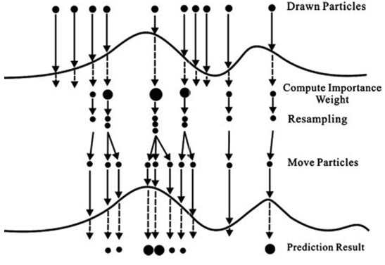
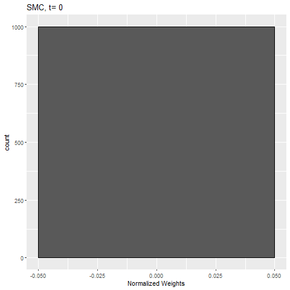
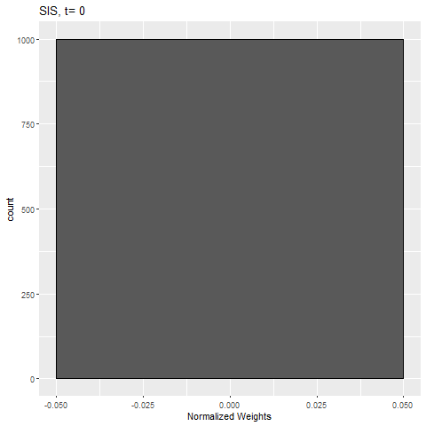

```{r setup, include=FALSE}
options(htmltools.dir.version = FALSE)
```

```{r, echo=F, message=F, warning=F}
rm(list=ls())
library(tidyverse)
library(Rmisc)
load('SMC.Rdata')
source('../Code/SMC_functions.R')
```

# Overview

### 1. Review: sequential estimation

### 2. Basic sequential Monte Carlo

### 3. Resampling techniques

### 4. Adaptive resampling

### 5. Example: nonlinear Gaussian state-space model

---

# Sequential Estimation

**Consider the sequential estimation problem:**

  - Sequence of hidden states, $\{x_t:t\in\mathbb{N}_1\}=x_{1:t}$
  
  - Sequence of observed states, $\{y_t:t\in\mathbb{N}_1\}=y_{1:t}$

<br>  
--

  - Want to make inference about:
  
    - Posterior distribution: $\pi_n(x_{1:n}|y_{1:n})$
    
    - Marginal likelihood of observations: $p(y_{1:n})$
    
    - Expectation of some function, $g$: $~\mathbb E_{\pi_n}[g(X_{1:n})]$
    
---

# Sequential Importance Sampling

--

**SIS seeks to make inference sequentially by:**

  - Sampling values from proposal distributions $q_n(x_n|x_{1:n-1},y_{1:n})$
  
  - Computing importance weights $w_n(X_{1:n})=w_{n-1}(X_{1:n-1})\delta(X_{1:n})$
  
--

**Gives us estimates:**

  - $\hat\pi_n(x_{1:n}|y_{1:n})=\sum_{i=1}^NW_n^i\delta_{X_{1:n}^i}(x_{1:n})\to$ Posterior distribution
  
  - $\hat p(y_{1:n})=\frac{1}{N}\sum_{i=1}^Nw_n(X_{1:n})\to$ Marginal likelihood
  
  - $\widehat{\mathbb E_\pi[g(X_{1:n})]}=\sum_{i=1}^Ng(X_{1:n})W_n^i\to$ Expectation of some function $g$
  
--

**Drawback of SIS:**

  - Rapid weight degeneracy
  
  - Often very few particles have non-negligible weights
  
  - Makes estimates very unstable in long run

---

class: inverse, center, middle

# Resampling

---

# What is resampling?

--

.pull-left[
**What this means is**

  - Start with $N$ particles having equal weights 

  - Particles are then evaluated and importance weights are computed

  - **Resampling:** Sample N times with *replacement* from the weighted set

  - All the resampled particles are of same size as weights are reset to $1/N$

  - Move forward **only** the resampled particles

  - *Multinomial resampling*
]

.pull-right[

]

---

# Why resampling?
<br>

--

  - Mitigates the problem of weight degeneracy 
  
    - Allows the proposal to better explore higher density regions of the state-space
  
    - Resampling essentially reallocates explorers to promising areas
 
<br>  

--

  - Helps us obtain approximate samples according to the target density 
 
---

class: inverse, center, middle

# Sequential Monte Carlo
 
---

# Sequential Monte Carlo

**Sequential Monte Carlo** is a class of methods for approximating sequences of distributions which follow the following general procedure:

--

*At time $n=0$*

1. *Sample* initial particles $\tilde X_0^i\sim q_0(x_0)$

1. *Compute* the weights $w_0^i(\tilde X_0^i)$ and $W_0^i\propto w_0^i$

1. *Resample* $\{\tilde X_0^i,W_0^i\}$ to get $\{X_0^i,1/N\}$

--

*At time $n\ge1$:*

1. *Sample* $\tilde X_n^i\sim q_n(x_n|X_{0:n-1}^i)$ and set $\tilde X_{0:n}^i\gets(X_{0:n-1}^i,\tilde X_n^i)$

1. *Compute* the weights $w_n^i(X_{1:n})=w_{n-1}^i\delta(X_{1:n})$ and $W_n^i\propto w_n^i$

1. *Resample* $\{\tilde X_{0:n}^i,W_n^i\}$ to get $\{X_{0:n}^i,1/N\}$

---

class: inverse, center, middle

# Resampling Techniques

---

# Resampling Techniques

**Systematic resampling**

  - Very popular resampling technique
    
    1. Sample  $U^1 \sim ~\text{Unif}\left(0,\frac{1}{N}\right)$
    
    1. Define $U^i = U+\frac{i-1}{N},~~i=2,\ldots,N$
    
    1. Set $N_n^i=\left|\left\{U^j: \sum_{k=1}^{i-1}W_n^k\le U^j\le\sum_{k=1}^iW_n^k\right\}\right|$

  <!-- - Cannot easily compute variance of the IS estimate -->
    
  - Empirically lower variance estimates than other methods
  
  - No theoretical guarantees
    
  <!-- - Empirically, performs better than most other methods  -->

--

**Residual sampling** 

  - Set the $N_n^i$ to be $\lfloor NW^i_n\rfloor$, plus a randomly distributed remainder term $N - \sum_{i=1}^N\lfloor NW^i_n\rfloor$
  
  - Guaranteed lower variance estimates than multinomial sampling


---

class: inverse, center, middle

# Adaptive Resampling

---

# Trade-off with Resampling

**Et tu, resampling?**

  - Shown resampling improves stability of estimates by mitigating weight degeneracy
  
  - Actually adds variance to immediate estimate $\widehat{\mathbb E_{\pi_n}(g(X_{1:n}))}$
  
  - So there is a trade-off: resampling improves long-term stability at cost of immediate precision
  
--

<br>
<br>

**How do we fix this?**

  - Strike balance between resampling at every step, and never resampling
  
  - Now need a measurement of degeneracy

---

# Effective Sample Size

**Want a measure of the degeneracy in a sample of weighted particles:**

  - In class discussed *effective sample size (ESS)*, $N_\text{eff}$
  
  - If we have $N$ weighted particles, they are "worth" $N_\text{eff}$ i.i.d. samples from our target distribution

  - Can estimate $N_{\text{eff}}$ by
$$\widehat{N_\text{eff}}=\left[\sum_{i=1}^N\left(W^i\right)^2\right]^{-1}$$

    - $\widehat{N_\text{eff}}=N$ iff $W^i=\frac{1}{N}$ $\forall i$
    - $\widehat{N_\text{eff}}=1$ iff $W^i=1$ for exactly one $i$

--

<br>

**Alternative measures of weight degeneracy:**

  - Coefficient of variation of the normalized weights
  
  - Shannon entropy of the normalized weights
  
---

# Adaptive Resampling

**We have established:**

  1. Resampling at every step introduces unnecessary variance to our IS estimates
  
  1. A rule of thumb for measuring weight degeneracy in a sample of particles

--

<br>
<br>

*Adaptive resampling* combines these two notions:

  - Instead of resampling at every step, only resample when particle degeneracy reaches a certain threshold

  - $\widehat{N_\text{eff}}=0.5N$ is widely used as such a threshold
  
  - This gives us the benefit of resampling while minimizing the costs

---

class: inverse, center, middle

# Example: Nonlinear Gaussian State-Space Model

---

# Nonlinear Gaussian State-Space Model

**A nonlinear Gaussian state-space model** is characterized by the following two equations:
\begin{align}
    X_t &= f(X_{t-1})+V_t, &V_t\sim\mathcal{N}(0,\Sigma_V)\\
    Y_t &= CX_t+W_t, &W_t\sim\mathcal{N}(0,\Sigma_W)
\end{align}

  - $X_t\in\mathbb{R}^{n_x}$ and $Y_t\in\mathbb{R}^{n_y}$
  
  - $f:\mathbb{R}^{n_x}\to\mathbb{R}^{n_x}$ is nonlinear
  
  - $C$ is a $n_y\times n_x$ *observation matrix*

--

<br>
<br>

Two popular methods for solving this system:

  - Sequential Monte Carlo
  
  - Extended Kalman Filter (not discussed here)

---

# Proposal Distribution & Importance Weight

**Proposal density:**

  - The optimal proposal density, $q_n^\text{opt}(x_n|x_{n-1}^i,y_n)$ is not always tractable
  
  - In this case we can derive it exactly
  
  - Can show that $X_n^i|X_{n-1},y_n\sim \mathcal{N}(m_n,\Sigma)$ is optimal
  
    - $\Sigma^{-1}=\Sigma_V^{-1}+C^T\Sigma_W^{-1}C$
    
    - $m_n=\Sigma\left(\Sigma^{-1}f(X_{n-1})+C^T\Sigma_W^{-1}y_n\right)$
    
--

<br>

**Importance weight function:**

  - Corresponding importance weight is $w_n^i=w_{n-1}^i~p(y_n|x_{n-1})$
  
  - Can show that here, $p(y_n|x_{n-1})\propto\exp\left[-\frac{1}{2}(y_n-Cf(X_{n-1}))^T(\Sigma_V+C\Sigma_WC^T)^{-1}(y_n-Cf(X_{n-1}))\right]$

---

# This Example

To demonstrate SMC we will simulate data from the following state-space model:
\begin{align}
    X_t &= \sin(X_{t-1})+V_t,~V_t\sim\mathcal{N}(0,1)\\
    Y_t &= 2X_t+W_t,~W_t\sim\mathcal{N}(0,1)
\end{align}

```{r, echo=F, fig.width=12, fig.height=4, fig.align='center', dpi=300}
ssm_data$SSM_plot+theme(plot.title = element_text(hjust = 0.5))
```

---

# Defining Parameters

```{r, eval=F}
# set parameters of the state-space model
n <- 100
sig.V <- 1
sig.W <- 1
C <- 2
f <- function(x){ return(sin(x)) }
```

--

```{r, eval=F}
## set parameters of the SMC
# number of particles
N <- 1000 

# proposal mean function and variance
Sig <- 1/(1/sig.V^2+C^2/sig.W^2)
m <- function( x, y ){ return( Sig*(f(x)/sig.V^2+C*y/sig.W^2) ) }

# incremental weight update function
S <- 1/(sig.V^2+C^2*sig.W^2)
w_func <- function( x, y ){ return( exp(-(y-C*f(x))^2*S/2) ) }
```

---

# Implementing SMC

```{r, eval=F}
for( i in 1:n )
{
  Z[i,] <- rnorm(N, mean=m(Z[i-1,],Y[i]), sd=sqrt(Sig)) # generate proposal from N(m,Sig)
  
  w[i,] <- w[i-1,]*w_func( Z[i-1,], Y[i] ) # compute the unnormalized weights
  
  W <- w[i,]/sum(w[i,]) # normalize the weights
  
  ESS <- 1/sum(W^2) # compute the ESS
  
  if( ESS<(0.5*N) ) # resample if ESS<0.5N
  {
    # resampling
    Z <- Z[,systematic_resample(W)]
    # reset the weights
    w[i,] <- rep(1,N)
  }
}
```

---

# Results

Below is a plot showing the 95% credible interval about $\pi_n(x_{0:n}|y_{1:n})$ along with the mean of the sequence

```{r, echo=F, fig.height=6, fig.width=14, fig.align='center', dpi=300}
SMC_summ$smc.plot
```

---

# Weight Degeneracy

To show how resampling improves the issue of weight degeneracy:

.pull-left[

]

.pull-right[

]

---

# Terminology

Sequential Monte Carlo $\supset$ particle filter $\supset$ bootstrap filter

--

<br>

  - Sequential Monte Carlo is a general class of particle methods which are composed of *sample*, *weight*, and *resample* steps
  
<br>
  
  - Particle filters specifically use past observations to make inference about the present

<br>

  - Bootstrap filter is a particle filter which uses the prior density, $f(x_t|x_{t-1})$ as a proposal
  
    - Popular choice for its simplicity, not its optimality
    
---

# Closing Remarks

**Sequential Monte Carlo is an imperfect solution:**

  - "It is inherently impossible to accurately represent a distribution on a space of arbitratily high dimension with a sample of fixed, finite size"
  
--

  - Particle degeneracy is unavoidable for a long enough sequence
  
  - There is hope!
  
    - Versions of SMC such as *resample-move* and *block SMC* exist to further mitigate degeneracy
    
--

<br>

**Some other interesting extensions of SMC:**

  - *Auxiliary particle filter*: uses a "look-ahead" approach when computing importance weights
  
  - *Annealed importance sampling*: targets static posterior distributions through a sequence of intermediate distributions
  
  - $SMC^2$: combination of SMC and PMCMC to estimate model parameters

---

# Closing Remarks

- Sequential Monte Carlo is a broad class of particle methods

  - Efficiently estimates sequences of distributions

  - Consists of 3 general steps: *Sample*, *Weight*, *Resample*
  
  - Many extensions for static distributions, parameter estimation, etc.

<br>

- Alternative sampling schemes & adaptive resampling to optimize the the resampling step


---

class: inverse, center, middle

# Thank you!
## Questions?

---

# References

*General:*
- Doucet, A. and Johansen, M. (2009). *A Tutorial on Particle Filtering and Smoothing: Fifteen years later*. Handbook of Nonlinear Filtering.

*Effective Sample Size:*
- Liu, S. (2001). *Monte Carlo Strategies in Scientific Computing*. Springer.

*Resampling:*
- Douc, R., Cappe, O., and Moulines, E. (2005). *Comparison of Resampling Schemes for Particle Filtering*. Proceedings of the 4th International Symposium on Image and Signal Procesing and Analysis.

- Carpenter, J. and Fearnhead, P. (2000). *An Improved Particle Filter for Non-linear Problems*. IEE Proc. Radar, Sonar Navig.

*Nonlinear Gaussian State-Space Model:*
- Doucet, A., Godsill, S., Andieu, C. (2000). *On sequential Monte Carlo sampling methods for Bayesian filtering*. Statistics and Computing.

---

# Appendix A
## Intuition behind effective sample size

**To gain intuition behind what effective sample size is, consider the following:**

  - Suppose you have $X_1,\ldots,X_N$ i.i.d. samples from a distribution with mean $\mu$ and variance $\sigma^2$
  
  - Then $\mathbb{Var}[\bar X]=\sigma^2/N$
  
  - However, if the samples are not independent then our variance will be greater: $$\mathbb{Var}[\bar X]=\sigma^2/N_\text{eff},~~N_\text{eff}\le N$$
  
--

<br>

**Can think of weighted samples as correlated**

  - In the sense that for one particle increase in weight another must decrease

---

# Appendix B
## Effective sample size: SMC vs. SIS

```{r, echo=F, fig.width=12, fig.height=5, fig.align='center', dpi=300}
p1 <- ESS_seq(SMC_results$w)$ESS_plot +
  geom_hline(yintercept=0.5*pars$N) +
  ylim(0,pars$N)+
  labs(title='Effective Sample Size: SMC')
p2 <- ESS_seq(SIS_results$w)$ESS_plot +
  ylim(0,pars$N)+
  labs(title='Effective Sample Size: SIS')
multiplot(p1,p2,cols=2)
```

---

# Appendix C
## Effect of proposal: optimal

```{r, echo=F, fig.width=12, fig.height=5, fig.align='center', dpi=300}
p1 <- SMC_summ$smc.plot + labs(title='Sequential Monte Carlo')
p2 <- SIS_summ$smc.plot + labs(title='Sequential Importance Sampling')
multiplot(p1,p2,cols=1)
```
---

# Appendix C
## Effect of proposal: prior

```{r, echo=F, fig.width=12, fig.height=5, fig.align='center', dpi=300}
p1 <- SMC_BF_summ$smc.plot + labs(title='Bootstrap Filter')
p2 <- SIS_BF_summ$smc.plot + labs(title='Sequential Importance Sampling')
multiplot(p1, p2, cols=1)
```

---

# Appendix D
## Choosing suboptimal proposals

**What if our optimal proposal distribution is intractable?**

  - Find reasonable suboptimal approximation of the optimal proposal
  
    - Local linearisation of the model or the proposal density
    
    - Not a straight-forward approach and is model-specific
    
--

<br>

  - Use our prior (transition) density, $f(x_t|x_{t-1})$ as our proposal
  
    - This implies an incremental weight update of $p(y_t|x_t)$
    
    - Very easy to implement
    
    - In the filtering context, referred to as the *Bootstrap filter*
    
---

# Appendix E
## Implementing systematic resampling

```{r, eval=F}
systematic_resample <- function( W ){
  K <- length(W)
  U <- runif(1,0,1/K) + 0:(K-1)/K
  
  W.sum <- cumsum(W)
  N <- rep(NA,K)
  j <- 1
  for( i in 1:K )
  {
    found = F
    while( !found )
    {
      if( U[i]>W.sum[j] )
        j <- j+1
      else
        found = T
    }
    N[i] <- j
  }
  
  return( N )
}
```

---

# Appendix F
## Residual resampling


Residual sampling defines $N^i=\lfloor NW^i\rfloor+\bar N^i$

  - $\bar N^1,\ldots,\bar N^N\sim\text{Multi}\left(N-R,\bar W^1,\ldots,\bar W^N\right)$
  
  - $R = \sum_{i=1}^N\lfloor NW^i\rfloor$
  
  - $\bar W^i=\frac{NW^i-\lfloor NW^i\rfloor}{N-R}$
  
    - Weights for which the difference $NW^i-\lfloor NW^i\rfloor$ is close to 1 will have greater remainder weight
  
--

<br>

So each particle produces $\lfloor NW^i\rfloor$ 'offspring' plus some random remainder

  - Also called "stochastic remainder resampling" in genetic algorithm literature

---

# Appendix G
## Alternative degeneracy measures

.pull-left[
**Coefficient of variation of the normalized weights**

  - $\text{CV}_N = \left[\frac{1}{N}\sum_{i=1}^N\left(NW^i-1\right)^2\right]$

    - $\text{CV}_N=0$ iff $W^i=\frac{1}{N}$ for all $i$
  
    - $\text{CV}_N=\sqrt{N-1}$ iff $W^i=1$ for one $i$
]

--

.pull-right[
**Shannon entropy of the normalized weights**  

  - $\text{Ent}=-\sum_{i=1}^NW^i\log_2W^i$

    - $\text{Ent}=\log_2N$ iff $W^i=\frac{1}{N}$ for all $i$
  
    - $\text{Ent}=0$ iff $W^i=1$ for one $i$
]

---

# Appendix H
## Choosing a resampling technique

- Want to choose a resampling technique which yields lower variance estimates than multinomial resampling

--

<br>

- Generally need to satisfy a few requirements

  1. "Unbiasedness": $\mathbb E[N^i]=NW^i$
  
  1. Particles are equally weighted after resampling
  
  1. Total number of particles does not change
  
--

<br>

- There are some exceptions