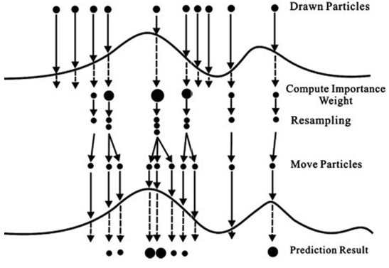

```{r, echo=F, message=F, warning=F}
rm(list=ls())
library(tidyverse)
knitr::opts_chunk$set(comment='', fig.height=3, fig.pos="H", fig.align="center")
```
\newpage
\pagestyle{fancy}
\setcounter{page}{1}
\section{Introduction}
\label{intro}

Real-world data analysis often requires estimating unknown quantities given only a sequence of related, observable quantities. In a Bayesian framework, one typically has prior knowledge of the model: a prior distribution over unobservable quantity of interest and likelihood functions which relate the observables to the unobservables. The resulting posterior distribution of the unobservables can be calculated using Bayes’ theorem. This allows one to conduct inference about the unobserved quantities. In some cases, it is natural to process observations sequentially.

In a sequential estimation problem, we are interested in making inference about the distribution of a sequence of random variables. Of particular interest here is the problem of estimating not a sequence of fixed length, but rather a sequence of distributions of increasing length. This is called *online inference*. In class, we were introduced to sequential importance sampling (SIS) as a method for solving this type of problem. In this report we introduce sequential Monte Carlo (SMC) as a more efficient alternative to SIS. In particular, SMC builds on the framework of SIS by incorporating a simple adaptation to the SIS algorithm which drastically improves the performance of the method. In Section 2 we introduce the notion of resampling and show how it provides more stable inference than SIS. Section 3 describes the basic sequential Monte Carlo algorithm. Then in Section 4 we discuss alternative resampling algorithms that improve the efficiency of the algorithm. Section 5 describes key drawbacks of resampling and Section 6 addresses a more subtle consequence of resampling and provides an adaptation of the basic SMC algorithm to work around these issues. Finally, in Section 7 we demonstrate the use of SMC on data simulated from a nonlinear Gaussian state-space model.

\subsection{Sequential estimation}

First, we will briefly review the terminology and framework of the sequential estimation problem used throughout the report. In this report, we consider a situation in which we have two sequences of random variables; a sequence of hidden random variables which is not directly observed, and a sequence of observed variables that are related to the hidden sequence. The hidden sequence is denoted by $\{X_n\}_{n\ge1}$, where each variable in the sequence is defined on some common state space $\mathcal{X}$. The observed sequence is denoted by $\{Y_n\}_{n\ge1}$, where each variable in the sequence is defined on some common state space $\mathcal{Y}$. The model is specified by three distributions. The first distribution is the initial distribution of the hidden states, $\mu_1(x_1)$. Second is the transition distribution, $g(x_n|x_{1:n-1})$, which defines how the hidden sequence evolves. Finally, the marginal likelihood of the observations, $f(y_n|x_n)$, which defines how our observations depend on the hidden state.

Here we are interested in making inference about the posterior distribution of the hidden states which we decompose below using Bayes rule.
$$\pi(x_{1:n}|y_{1:n}) = \frac{p(x_{1:n},y_{1:n})}{p(y_{1:n})}=\frac{\gamma_n(x_{1:n})}{Z_n}$$
The numerator, $\gamma_n(x_{1:n})$, is the unnormalized target density, where the dependence on the observations is suppressed for notational convenience. The denominator, $Z_n$, is the marginal likelihood of the entire sequence of observations, sometimes called the model evidence in Bayesian analysis. In addition to inferring the posterior distribution or model evidence, often we are interested in the posterior expectation of some function, denoted here as $\E_{\pi_n}[\varphi(X_{1:n})]$.

\subsection{Sequential importance sampling}

Before SMC can be introduced we must first review sequential importance sampling. SIS is a particle-based method, which means that we generate $N$ particles from a proposal distribution and assign each particle an importance weight. As seen in class, SIS requires that we select a proposal distribution of the form $q_n(x_{1:n})=q_1(x_1)\prod_{i=2}^nq_n(x_i|x_{1:i-1})$. This recursive factorization provides the following importance weight update.
\begin{align}
    w_n(x_{1:n}) &= w_{n-1}(x_{1:n-1})\alpha_n(x_{1:n})\label{eq:weight}\\
    \alpha_n(x_{1:n}) &= \frac{\gamma_n(x_{1:n})}{\gamma_{n-1}(x_{1:n-1})q_n(x_n|x_{1:n-1})}\label{eq:increm_weight}
\end{align}
where $w_n(x_{1:n})$ the unnormalized importance weight function and $\alpha_n(x_{1:n})$ is the incremental importance weight function. In this report, we denote $W_n^i$ as the normalized weight of the $i^{th}$ particle such that $\sum_{i=1}^NW_n^i=1$.

Running the SIS algorithm, given by Algorithm \ref{alg:SIS} in Appendix \ref{app:algos}, yields a weighted sample of particles $\{X_{1:n}^i,W_n^i\}_{i=1}^N$ which can be used to approximate the posterior distribution of the hidden states. In particular, we can derive the following estimates of interest.
\begin{subequations}\label{eq:estimates}
\begin{align}
    \hat\pi_n(x_{1:n}) &= \sum_{i=1}^NW_n^i\delta_{X_{1:n}^i}(x_{1:n})\label{eq:est_post}\\
    \hat Z_n &= \frac{1}{N}\sum_{i=1}^Nw_n(X_{1:n}^i)\label{eq:est_Z}\\
    \hat\E_{\pi_n}[\varphi(X_{1:n})] &= \sum_{i=1}^NW_n^i\varphi(X_{1:n}^i)\label{eq:est_E}
\end{align}
\end{subequations}

While SIS does have notable improvements over importance sampling (IS) in terms of both statistical and computational efficiency, there is one major drawback of SIS which renders it very impractical. In practice, we often find that within very few steps of the algorithm a small number of particles carry most of the probability mass \cite{15YL}. This is known as weight degeneracy. While a well-chosen proposal can help, this is unavoidable in SIS. Once a particle has been initialized to a region of low posterior density it is given lower and lower weight. The result is the posterior distribution being estimated by a single point which contains all of the probability mass. This is very unstable as it depends strongly on the initial sample of proposed particles. To mitigate this issue we introduce resampling.


\section{Resampling}\label{resampling}

An intuitive way to think of resampling is rejuvenating the set of samples by duplicating the samples with high importance weights and removing the samples with low weights. In order to get a more comprehensive understanding, let us look at Figure \ref{fig:resampling} \cite{blog} that illustrates the process of resampling.

```{r, echo=F, out.height="30%", fig.cap="\\label{fig:resampling}Illustration of the resampling step for time point $n$."}

```


Consider an arbitrary time point $n$. All particles have the same weights, at this stage of the process. This is represented by the first set of particles having equal sizes in Figure \ref{fig:resampling}. We then evaluate the likelihood of the particles and compute their importance weights. We can see that some particles are larger in size corresponding to a higher weight, while others are smaller in size, and some have completely disappeared, indicating that they received negligible weights. 

Next, we introduce the resampling step. Let $N$ be the total number of particles considered. The resampling step involves sampling, with replacement, $N$ times from the weighted set, to generate a new sample of  particles. Note that at the resampling stage, the particle with the largest importance weight happens to be resampled thrice and the less important particles fewer times. Once resampling is performed, all the resampled particles have the same size because all weights are reset to  $\frac{1}{N}$. At each generation we still have $N$ particles at our disposal, even though some from the previous generation have “died”. Thereafter, at time point $n+1$, samples are drawn from the proposal density based on the resampled particles only.

This scheme of resampling is called multinomial resampling because the particles are sampled with replacement N times; each particle has a probability of being drawn corresponding to its normalized weights.


Since resampling is done with replacement, a particle with a large weight is likely to be drawn multiple times whereas particles with very small weights are not likely to be drawn at all. Recall that generating particles is about exploring regions of the space where the integral has most of its mass. Therefore, we want to focus the computational effort on the “promising” areas of the space. This is accomplished if we “propagate forward” the promising particles, which are those with greater weight. Resampling allows the proposal to better explore these "promising" areas by reallocating particles to high density regions. Thus, the resampling step helps us overcome the problem of weight degeneracy.


\section{Sequential Monte Carlo}\label{smc}

In Section \ref{intro}, we reviewed the sequential importance sampling algorithm for estimating a sequence of random variables. Furthermore, we noted weight degeneracy as one of its major drawbacks that can render our estimates very unstable in the long-run. To that end, in Section \ref{resampling} we introduced the notion of resampling to mitigate this issue of weight degeneracy. In this section, we will combine the ideas of SIS and resampling to introduce the basic *sequential Monte Carlo* (SMC) algorithm. 

Sequential Monte Carlo methods are a class of Monte Carlo algorithms used for estimating sequences of distributions and expectations, especially in signal processing and Bayesian statistical inference \cite{smcsignal}. It can be characterized by the following general procedure:

\begin{algorithm}[H]
\SetAlgoLined
 \For{n=1}{
  Sample $X_1^i\sim q_1(x_1)$ for $i=1,\ldots,N$\;  
  Compute the weights $w_1^i(X_1^i)=\gamma_1(x_1)/q_1(x_1)$ and $W_1^i  \propto w_1^i$\;  
  Resample $\{X_1^i, W_1^i \}$ to get $N$ equally weighted particles $\{\bar X_1^i, \frac{1}{N}\}$\;
  }
  \For{$n\ge2$}{
  Sample $X_n^i\sim q_n(x_n|\bar X_{1:n-1}^i)$ and set $X_{1:n}^i \leftarrow (\bar X_{1:n-1}^i, X_n^i)$\;  
  Compute the weights $w_n^i(X_{1:n}^i)=w_{n-1}^i\alpha_n (X_{1:n}^i)$ and $W_n^i  \propto w_n^i$\;  
    Resample $\{X_{1:n}^i, W_n^i \}$ to get $N$ equally weighted particles $\{\bar X_{1:n}^i, \frac{1}{N}\}$\;
  }
 \caption{Sequential Monte Carlo}
\end{algorithm}

At time step 1, we generate the initial particles from the proposal distribution $q_1(x_1)$ and compute the unnormalized importance weights $w_1^i(X_1^i)$. This weighted collection of particles $\{X_1^i, W_1^i \}$ is the IS approximation of the target density $\pi_1(x_1)$. In contrast to the SIS algorithm, here we introduce the resampling step to eliminate those particles with low weights and duplicate those with high weights. The weights are reset to $\frac{1}{N}$ and we end up with an equally weighted collection of resampled particles $\{\bar X_1^i, \frac{1}{N}\}$. Some particles in this equally weighted collection might have multiple offspring after being resampled. In that sense, $\bar X_1^i$ takes on distinct indices corresponding to the different offspring. For instance, in Figure \ref{fig:resampling}, the fifth particle was resampled thrice and hence had 3 offspring in the equally weighted collection of resampled particles. Therefore, at time point $(n-1)$, $\bar X_{n-1}^i$  would take on three distinct indices corresponding to the three resampled particles. 

For time points $n \ge 2$, we again follow the SIS strategy to generate particles from the proposal density given the resampled particles $X_n^i \sim q_n(x_n|\bar X_{1:n-1}^i)$. This gives us the path of the particle $X_{1:n}^i$ up to time point $n$. The importance weights are calculated by multiplying the incremental weight $\alpha_n (X_{1:n}^i)$ with the previous unnormalized weight $w_{n-1}^i$. Again, resampling is performed to obtain an equally weighted collection of particles.


\section{Resampling Techniques}\label{resamp_tech}

Let us put the idea of resampling into more mathematical terms. Consider the IS approximation of the target density $\hat \pi(x_{1:n} | y_{1:n})$. This approximation is based on a weighted collection of particles generated from the proposal distribution $q_n(x_{1:n} | y_{1:n})$ and thus is not distributed according to the target density, $\pi(x_{1:n} | y_{1:n})$. In order to obtain a sample approximately distributed according to the target density, we introduce the resampling step. This enables us to sample from the IS approximation so that the particles with higher importance weights are sampled more frequently.

Let $N_n^i$ be the number of times the $i^{th}$ particle was resampled at time point $n$. After each resampling step, the weights are reset and each resampled particle in the collection is assigned a weight of $\frac{1}{N}$. We approximate the IS approximation  $\hat \pi(x_{1:n} | y_{1:n})$ by the resampled empirical measure:
\begin{equation}
\bar \pi(x_{1:n} | y_{1:n}) = \sum_{i=1}^N \frac{N_n^i}{N} \delta_{X_{1:n}^i} (x_{1:n})
\label{eq1}
\end{equation}

In practice, any resampling technique can be used provided it has the following properties \cite{resampling}:
\begin{itemize}
\setlength{\itemsep}{0.1em}
\item The number of particles $N$ does not vary after resampling
\item Equally weighted particles, $W_n^i=1/N$, after resampling
\item Possesses "unbiasedness" or "proper weighting" property, $\E[N_n^i|W_n^{1:N}]=NW_n^i$ 
\end{itemize}

\subsection{Multinomial resampling}

As stated earlier in Section \ref{resampling}, if we resample with replacement $N$ particles, with probabilities proportional to their importance weights, then we have:
\begin{equation*}
N_n^{1:N} = (N_n^1,\ldots, N_n^N) \sim \text{Multinomial}(N, W_n^{1:n})
\end{equation*}
Here, $\E[N_n^i | W_n^{1:N}] = NW_n^i$ and hence multinomial resampling possesses the unbiasedness property. We have $\bar \pi(x_{1:n} | y_{1:n})$, given by Equation (\ref{eq1}), is an unbiased approximation of $\hat \pi(x_{1:n} | y_{1:n})$.

This is the most basic approach, used in the bootstrap filter of Gordon et. al \cite{smcsignal}. However, one of the drawbacks associated with this scheme is the high variance that it introduces into the algorithm \cite{resampling}. In order to remedy this issue, we introduce alternative resampling schemes in the following subsections. 

\subsection{Residual resampling}

Residual sampling \cite{residual}, also known as stochastic remainder resampling, improves upon the multinomial scheme by guaranteeing lower variance posterior estimates and favourable computation time \cite{resampling}. With residual sampling we assign the number of offspring according to,
\begin{align}
N_n^i = \floor*{NW_n^i} + \bar N_n^i
\label{eq:res}
\end{align}
where, $\floor*{.}$ denotes the integer part and $\bar N_n^{1:N}  \sim \text{Multinomial}(N - R, \bar W_n^{1:n})$. Here, $R = \sum_{i=1}^N \floor*{NW_n^i}$ and the weights are given by,
\begin{align*}
\bar W_n^i = \frac{NW^i - \floor*{NW_n^i}}{N - R}
\end{align*}
The first term in Equation (\ref{eq:res}), $\floor*{NW_n^i}$ guarantees that each particle has the integer part of its expected number of offspring. The second term, $\bar N_n^i$, is the stochastic remainder term. This corresponds to the remaining offspring being distributed randomly across the particles; particles whose guaranteed term is further from their expected number of offspring have greater weight. We can easily see that residual sampling scheme satisfies the unbiasedness property.
 
\subsection{Systematic resampling}

One of the most popular resampling schemes in practice is systematic resampling \cite{systematic}. This approach attempts to reduce the randomness in resampling by using only a single uniform random variable and deterministically generating $N-1$ subsequent variables. The scheme is as follows:
\begin{itemize}
\setlength{\itemsep}{0.1em}
    \item Sample  $U^1 \sim \text{Unif}(0,\frac{1}{N})$
    \item Define $U^i = U^1+\frac{i-1}{N},~~i=2,\ldots,N$
    \item Set $N_n^i=|\{U^j: \sum_{k=1}^{i-1}W_n^k\le U^j\le\sum_{k=1}^iW_n^k\}|$
\end{itemize}

Empirically, systematic resampling outperforms most of the other resampling techniques in the sense that it is easier to implement and results in lower variance estimates \cite{15YL}. However, there is no theoretical guarantee that this is always the case. The reason behind this being that it is extremely difficult to compute the variance of the estimates resulting from systematic resampling. Since the resampled particles are not conditionally independent given the weights, this method is much more difficult to derive theoretical results for relative to other resampling schemes. We implement systematic resampling in `R` using the code below.

```{r}
systematic_resample <- function( W ){
  K <- length(W)
  U <- runif(1,0,1/K) + 0:(K-1)/K
  
  W.sum <- cumsum(W)
  N <- rep(NA,K)
  j <- 1
  for( i in 1:K )
  {
    found = F
    while( !found )
    {
      if( U[i]>W.sum[j] )
        j <- j+1
      else
        found = T
    }
    N[i] <- j
  }
  
  return( N )
}
```


\section{The Cost of Resampling}\label{drawbacks}

While resampling is very effective at reducing weight degeneracy, as suggested in Section \ref{resampling}, it comes at a price. In this section we will first introduce the notion of sample degeneracy, an issue separate from weight degeneracy which is brought about by the resampling step.

Recall that in the resampling step, particles with high importance tend to be replicated while low importance particles tend to be removed from the sample. Consider the sample of particles representing the first time step. After each resampling, the sample at $t=1$ will be composed of fewer unique particles. It is easy to see that after enough resampling steps, eventually there will be exactly one unique particle representing $X_1$. This is called *sample degeneracy* and is a major drawback of SMC. In essence, resampling attempts to preserve a well-behaved final estimate at the cost of reducing the effective information about the paths themselves.

In a sequential estimation problem, we are interested in making inference about a distribution of arbitrarily increasing dimension. It is not possible to accurately represent such a distribution with a fixed number of particles. In particular, for any fixed $N$, we can choose a sequence of length $n$ such that there will be exactly one unique particle carrying all of the probability mass \cite{15YL}. In SIS this means $N$ unique particles with one particle having a normalized weight of 1. However, in SMC this means having $N$ particles with identical values.

In addition to the issue of sample degeneracy, the act of resampling introduces another source of variability into our particle approximation. This means that at some time step $n$, resampling actually increases the variance of any estimate we compute using the resampled particles. This is explained more formally by Nicolas Chopin \cite{clt}, who derives asymptotic distributions of the posterior expectation estimates. In other words, each time we resample we increase the variance of our estimates and the degeneracy of our sample.

While both SIS and SMC are imperfect solutions to the sequential estimation problem, weight degeneracy in SIS compounds at a much more rapid rate than sample degeneracy in SMC. Furthermore, there are modifications and adaptations of SMC that mitigate sample degeneracy. In the next section we introduce a simple modification called *adaptive resampling*.


\section{Adaptive Resampling}\label{adaptive}

In the previous section, we have established that each time resampling is performed it incurs a penalty on the precision of our estimates. Here we introduce a simple modification to the basic SMC algorithm which aims to reduce the total number of times we resample our particles. The goal is to strike a balance between never resampling, where we experience rapid weight degeneracy, and resampling at every step, where we incur the previously described penalties unnecessarily.


\subsection{Effective sample size}

In order to efficiently implement resampling, we would like to quantitatively assess the weight degeneracy in our sample. To that effect, we introduce effective sample size (ESS) as one such measure. ESS was first introduced by Jun Liu in 1996 \cite{ESS_original}. The idea behind ESS is to determine the relative efficiency of an estimator which relies on a sample of weighted draws from a proposal distribution to an estimator based on i.i.d. samples from the target distribution. To do this the ESS of a sample of $N$ weighted particles is defined as $$ESS=\frac{N}{1+\var_q(w)}.$$
Since we often only know the target distribution up to a normalizing constant we cannot compute this variance exactly.
A derivation based on a delta method approximation (\cite{ESS_original}, \cite{MCStrategies}) yields the following estimate of ESS \cite{HMM}.
$$\widehat{ESS}=\left[\sum_{i=1}^N\left(W^i\right)^2\right]^{-1}$$
This estimates takes on values between 1 and $N$. If $\widehat{ESS}=N$, then we have $N$ equally weighted particles and no degeneracy in our sample. On the other hand, if $\widehat{ESS}=1$, then we have exactly 1 particle with all of the probability mass which is the most degenerate that our sample can be. Note that this is only a rule of thumb and not a true measure of weight degeneracy.

Other such rules of thumb exist, such as the coefficient of variation or the Shannon entropy of the normalized weights. These are not discussed here, but some details are given in Appendix \ref{app:degeneracy_alt}.


\subsection{Adaptive resampling}

Adaptive resampling is a simple modification of the basic SMC algorithm where we only resample when the weight degeneracy is sufficiently severe. In particular, the variation we introduce here is such that we only perform the resampling step when our ESS is below some threshold, $N_T$; Doucet et al. suggest a threshold of $N_T=N/2$ \cite{15YL}.
In practice, however, a different $N_T$ can be chosen. Note that $N_T=N$ recovers the basic SMC algorithm.
The SMC algorithm with adaptive resampling is given by Algorithm \ref{alg:SMC_wAR} below.

\begin{algorithm}[H]
\SetAlgoLined 
 \For{n=1}{
  Sample $X_1^i\sim q_1(x_1)$ for $i=1,\ldots,N$\;  
  Compute the weights $w_1^i(X_1^i)=\gamma_1(x_1)/q_1(x_1)$ and $W_1^i  \propto w_1^i$\;  
  \If{$\widehat{ESS}<N/2$}{
  Resample $\{X_1^i, W_1^i \}$ to get $N$ equally weighted particles $\{\bar X_1^i, \frac{1}{N}\}$\;
  }}
  \For{$n\ge2$}{
  Sample $X_n^i\sim q_n(x_n|\bar X_{1:n-1}^i)$ and set $X_{1:n}^i \leftarrow (\bar X_{1:n-1}^i, X_n^i)$\;  
  Compute the weights $w_n^i(X_{1:n}^i)=w_{n-1}^i\alpha_n(X_{1:n}^i)$ and $W_n^i  \propto w_n^i$\;  
  \If{$\widehat{ESS}<N/2$}{
    Resample $\{X_{1:n}^i, W_n^i \}$ to get $N$ equally weighted particles $\{\bar X_{1:n}^i, \frac{1}{N}\}$\;
  }}
 \caption{Sequential Monte Carlo with adaptive resampling}
 \label{alg:SMC_wAR}
\end{algorithm}


\section{Example: Nonlinear Gaussian State-Space Model}\label{example}

To demonstrate sequential Monte Carlo we will work through an example where we are interested in the posterior distribution of the hidden states in a state-space model. The particular state-space model we will be considering here is an example of a nonlinear Gaussian state-space model. We will introduce how this type of model is specified and then simulate data from this model. The rationale for choosing a nonlinear Gaussian state-space model is that it admits a closed form for the optimal proposal distribution and incremental weight function. If possible, one should always used the optimal proposal distribution as it is the most efficient proposal \cite{SMCforBF}. Next, we will show how sequential Monte Carlo can be implemented very easily using only functions from base `R`. Finally, we will provide results from SMC including some visualizations to help demonstrate how resampling is an effective tool against weight degeneracy.


\subsection{The simulation model}

In general, a state-space model consists of two sequences of random variables, a hidden sequence, $\{X_n\}_{n\ge1}$, and an observed sequence, $\{Y_n\}_{n>1}$. These two sequences are related through the following relationships called the *state transition equation* and *observation equation* respectively. A nonlinear Gaussian state-space model assumes a particular form where we can express these two equations as
\begin{align*}
    X_t &= f(X_{t-1})+V_t,~~~V_t\sim\mathcal{N}(0,\Sigma_V)\\
    Y_t &= CX_t+W_t,~~~W_t\sim\mathcal{N}(0,\Sigma_W)
\end{align*}
Here $X_t\in\mathcal{X}\subseteq\mathbb{R}^{d_x}$ and $Y_t\in\mathcal{Y}\subseteq\mathbb{R}^{d_y}$. These equations are characterized by a nonlinear function $f:\mathcal{X}\to\mathcal{X}$, a $d_x\times d_y$ *observation matrix* $C$, and transition and measurement noise $\Sigma_V>0$ and $\Sigma_W>0$.

For our simulation, we simulate $n=100$ time steps from a model where $d_x=d_y=1$, our nonlinear function is sine, $\Sigma_V=\Sigma_W=1$, and $C=2$. The simulated data can be seen in Figure \ref{fig:ssm_data} in Appendix \ref{app:supp_plots}.

```{r}
# set state-space model parameters
n <- 100    # length of sequence
sig.V <- 1  # transition noise
sig.W <- 1  # measurement noise
C <-  2     # observation scalar
f <- function(x){ sin(x) } # nonlinear function

set.seed(1)

# create empty storage vectors
X <- rep(NA,(n+1))
Y <- rep(NA,n)

# initialize hidden states
X[1] <- rnorm(1,0,sig.V)

# simulate rest of SSM from dynamics
# x(t) = f(x(t-1)) + V(t)
# y(t) = Cx(t) + W(t)
for( i in 1:n )
{
  X[i+1] <- f(X[i]) + rnorm(1,0,sig.V)
  Y[i] <- C*X[i+1] + rnorm(1,0,sig.V)
}
```


\subsection{Proposal distribution and importance weights}

In order to implement SMC, as with SIS, we need to define the proposal distribution and incremental importance weight function. For simplicity, in this example we will assume that we know the true parameters of the distribution.
While in general the optimal proposal distribution is not tractable, in the case of a nonlinear Gaussian state-space model we can derive the exact form of the optimal proposal distribution and the corresponding incremental weight update function.

It is shown in \cite{SMCforBF} that the optimal proposal density for a model where the hidden states follow a Markov process is of the form $q_n^\text{opt}(x_n|x_{n-1},y_n)$. It can be shown that the optimal proposal density for a nonlinear Gaussian state-space model is
$$X_t|X_{t-1}^i,y_t\sim\mathcal{N}(m_t(X_{t-1}^i,y_t),\Sigma),$$
where the mean function and covariance are given by:
\begin{align*}
    m_t(X_{t-1}^i,y_t) &= \Sigma\left(\Sigma_V^{-1}f(X_{t-1})+C^T\Sigma_W^{-1}y_t\right)\\
    \Sigma^{-1} &= \Sigma_V^{-1}+C^T\Sigma_W^{-1}C
\end{align*}

The incremental weight update function that satisfies Equation \ref{eq:increm_weight}, which is implied by the optimal proposal density, is the marginal likelihood of the observations given the previous hidden state, $p(y_t|X_{t-1}^i)$. In general this density is not tractable as it requires integrating out the current hidden state $X_t$. However, in the case of a nonlinear Gaussian state-space model the incremental weight function can shown to be \cite{SMCforBF}.
$$\alpha_t(x_{1:t})=p(y_t|X_{t-1})\propto\exp\left[-\frac{1}{2}(y_t-Cf(X_{t-1}))^T(\Sigma_V+C\Sigma_WC^T)^{-1}\right]$$
Since $\alpha_t(x_{1:t})$ is used to compute the unnormalized weight, we only need to specify it up to a constant of proportionality.


## Implementing SMC in `R`

Having defined our model, simulated our data, and defined our proposal distribution and incremental weight function, we now implement the SMC algorithm. The first step, shown below, is to define the SMC algorithm parameters. Here we will run SMC using $N=1000$ particles.

```{r}
# set SMC parameters
N <- 1000 # number of particles

Sig <- 1/(1/sig.V^2+C^2/sig.W^2) # proposal variance
m <- function( x, y ){ return(Sig*(f(x)/sig.V^2+C*y/sig.W^2)) } # proposal mean function

S <- 1/(sig.V^2+C^2*sig.W^2) # variance matrix for weight update

# set weight update function
w_func <- function( x, y ){
  return( exp(-(y-C*f(x))^2*S/2) )
}
```

Now to implement SMC we run the code below.
Here we will implement the systematic resampling algorithm whenever the threshold $N_T=N/2=500$ is reached.

```{r, echo=F}
set.seed(2)
```
```{r}
# create empty (n+1)xN matrices for hidden states, weights
Z <- matrix(NA, nrow=n+1, ncol=N)
w <- matrix(NA, nrow=n+1, ncol=N)

# storage vectors for ESS and number of unique particles at time 1
ESS <- rep(NA, n)
unique_vec <- rep(NA,n)

# initialize hidden sequence and unnormalized weights
Z[1,] <- rnorm(N,0,sig.V)
w[1,] <- rep(1,N)

# run SMC
for( i in 1:n )
{
  # generate proposal from N(m,Sig)
  Z[i+1,] <- rnorm(N, mean=m(Z[i,],Y[i]), sd=sqrt(Sig))
  
  # compute the unnormalized weights
  w[i+1,] <- w[i,]*w_func( Z[i,], Y[i] )
  
  # normalize the weights
  W <- w[i+1,]/sum(w[i+1,])
  
  # compute the ESS
  ESS[i] <- 1/sum(W^2)
  
  # count the number of unique particles representing the first state
  unique_vec[i] <- length(unique(Z[2,]))
  
  # resample if ESS<N_thresh
  if( ESS[i]<500 )
  {
    # resampling
    Z <- Z[,systematic_resample(W)]
    # reset the weights
    w[i+1,] <- rep(1,N)
  }
}
```
```{r, echo=F}
SMC_results <- list(Z=Z, w=w, ESS=ESS, unique_vec=unique_vec)
```


\subsection{Results}

After running the SMC algorithm we have a sample of weighted particles, $\{X_{0:100}^i,W_{100}^i\}_{i=1}^N$. This sample can be used to estimate properties of the posterior distribution, as defined in Equations \ref{eq:est_post}-\ref{eq:est_E}. To illustrate a simple example, here we will estimate a 95\% credible band about the posterior distribution of the hidden states. We will compute the band as $\hat \E_{\pi_n}[X_t]\pm1.96\times\widehat{sd}_{\pi_n}(X_t)$ for $t=1,\ldots,100$. We compute $\hat\E_{\pi_n}[X_t]$ and $\widehat{sd}_{\pi_n}(X_t)$ using Equation \ref{eq:est_E} with $\varphi(X_{1:n})=X_t$ and $\varphi(X_{1:n})=(X_t-\hat\E_{\pi_n}[X_t])^2$. The resulting plot is given below in Figure \ref{fig:credible_band}.

```{r, echo=F, fig.cap="\\label{fig:credible_band}The credible band about the posterior distribution of the hidden states. The true hidden states are shown in orange."}
## compute the posterior means and standard deviations
# compute the normalized weights
W <- w/rowSums(w)

# compute the posterior means
means <- rowSums(W*Z)

# compute the posterior standard deviations
temp <- matrix(nrow=nrow(Z), ncol=ncol(Z))
for( i in 1:nrow(temp) )
  temp[i,] <- Z[i,] - means[i]
sds <- apply(W*temp^2, 1, function(x){sqrt(sum(x))})

# plot the 95% credible band
results <- data.frame(time=0:n,
                      val=c(means,means-1.96*sds,means+1.96*sds,X),
                      type=c(rep('mean',n+1),rep('L',n+1),rep('U',n+1),rep('Obs',n+1)))

ribbon.df <- data.frame(time=0:n, L=means-1.96*sds, U=means+1.96*sds)

ggplot() +
  geom_line(aes(x=time,y=val,color=type), data=filter(results,type!='Obs') ) +
  geom_point(aes(x=time,y=val,color=type), data=filter(results,type=='Obs'))+
  geom_ribbon(aes(x=time, ymin=L,ymax=U), data=ribbon.df, fill='grey70', alpha=0.5)+
  labs(x='Time',y='Sequence Values',title='Posterior 95% Credible Band')+
  theme(plot.title = element_text(hjust=0.5))+
  scale_colour_manual(breaks=c('mean','L','Obs'),
                      values=c('mean'='black','L'='steelblue','U'='steelblue','Obs'='orangered'),
                      labels=c('mean'='Mean','L'='95% post. band','Obs'='Truth'),
                      name='Sequence')
```

In the above plot we can see that the credible band appears to be very reasonable; it captures most of the hidden states without being too wide. We can also see that the posterior standard deviation is fairly constant throughout the sequence.

To illustrate how resampling mitigates weight degeneracy, we estimated the effective sample size at each step of the SMC algorithm as well as at each step of SIS with identical proposal distribution. The results are shown below in Figure \ref{fig:ESS}.

```{r, echo=F, fig.cap="\\label{fig:ESS}Estimated effective sample size at each step for both SMC and SIS."}
## IMPLEMENT SEQUENTIAL IMPORTANCE SAMPLING

set.seed(3)

# create empty (n+1)xN matrices for hidden states, weights
Z <- matrix(NA, nrow=n+1, ncol=N)
w <- matrix(NA, nrow=n+1, ncol=N)

# storage vectors for ESS and number of unique particles at time 1
ESS <- rep(NA, n)
unique_vec <- rep(NA,n)

# initialize hidden sequence and unnormalized weights
Z[1,] <- rnorm(N,0,sig.V)
w[1,] <- rep(1,N)

# run SIS
for( i in 1:n )
{
  # generate proposal from N(m,Sig)
  Z[i+1,] <- rnorm(N, mean=m(Z[i,],Y[i]), sd=sqrt(Sig))
  
  # compute the unnormalized weights
  w[i+1,] <- w[i,]*w_func( Z[i,], Y[i] )
  
  # normalize the weights
  W <- w[i+1,]/sum(w[i+1,])
  
  # compute the ESS
  ESS[i] <- 1/sum(W^2)
  
  # count the number of unique particles representing the first state
  unique_vec[i] <- length(unique(Z[2,]))
}

SIS_results <- list(Z=Z, w=w, ESS=ESS, unique_vec=unique_vec)

# plot the ESS for SMC and SIS
data.frame( t=rep(1:n,2),
            ESS=c(SMC_results$ESS,SIS_results$ESS),
            alg=c(rep('SMC',n),rep('SIS',n))) %>%
  ggplot(aes(x=t,y=ESS)) +
  geom_point(aes(color=alg), size=1) +
  geom_hline( yintercept=500 ) +
  scale_colour_manual(values=c('orangered', 'steelblue'), name='Algorithm') +
  labs( x='Time', y='Effective Sample Size', title='Effective Sample Size for SMC and SIS')+
  theme(plot.title = element_text(hjust = 0.5) )
```


We can see from the plot that whenever the sample in SMC dips below the resampling threshold, as indicated by the horizontal line, resampling brings the ESS back up to $N$. On the other hand, the sample generated from SIS sinks down towards 0 and never climbs back up. This clearly illustrates how resampling is an effective tool against weight degeneracy

The next plot illustrates the issue of sample degeneracy addressed in Section \ref{drawbacks}. Recall that while resampling reduces weight degeneracy in a sample, it reduces the number of unique particle paths being used to represent the sequence. To illustrate this, we have computed the total number of unique particles representing $X_1$ at each step of the SMC algorithm. For comparison, we have also shown the same for SIS which does not perform any resampling.

```{r, echo=F, fig.cap="\\label{fig:nunique}Number of unique particles representing the first state in the sequence at each progressive step of the algorithm. Point size indicates the ESS of the sample."}
# plot of number of unique particles for SMC and SIS
data.frame( t = rep(1:n, 2),
            nunique = c(SMC_results$unique_vec, SIS_results$unique_vec),
            rESS = c(SMC_results$ESS, SIS_results$ESS)/N,
            alg = c(rep('SMC',n), rep('SIS',n)) ) %>%
  ggplot(aes(x=t, y=nunique)) +
  geom_point(aes(color=alg, size=rESS), alpha=0.7)+
  scale_size( range=c(1,3),breaks=seq(0,1,length.out=20),guide='none') +
  scale_colour_manual(values=c('orangered', 'steelblue'), name='Algorithm')+
  labs(x='Time', y='Number of unique particles', title='Number of unique particles at t=1') +
  theme(plot.title = element_text(hjust = 0.5) )
```

From this plot we can see that with SMC, even though we have well-distributed weights, the particles themselves are degenerating; by $t=100$ the first time step is only being represented by roughly 100 unique particles out of 1000 total. The size of the points corresponds to the ESS of the sample at each time step. So we can see that while SIS maintains a full set of unique particles, the information contained by these particles is not equivalent to 1000 i.i.d. samples. From this it is very easy to see how resampling at every step could have a drastic impact on the sample degeneracy of the resulting collection of particles.

# Summary

We have reviewed the SIS algorithm for the estimation of a sequence of random variables. Thereafter, we identified weight degeneracy as one of the main causes of its poor performance in practice. That is to say, only a small number of particles have non-negligible weights. We proposed resampling as a means to mitigate this problem and elaborated on several alternative resampling techniques. Sequential importance sampling coupled with the notion of resampling constitutes the basis of the generic sequential Monte Carlo algorithm. In this report, we discuss SMC, a numerical technique based on importance sampling for solving the sequence estimation problem. First, we explained the generic SMC algorithm which involved resampling at every step. Next, we discussed practical issues associated with the basic SMC algorithm, and in that context introduced the notion of adaptive resampling with effective sample size to optimize the resampling step.  Finally, we demonstrated the use of SMC on non-linear Gaussian state-space model and illustrate its ability to mitigate the problem of weight degeneracy. 

The aim of this report is to present a comprehensive overview of SMC that has been proposed for the task of efficiently estimating a sequence of distributions. It consists of three general steps: *sample, weight, and resample*. Different versions of the SMC algorithm employ variants of these steps. In the ever-expanding literature of approximate inference, sequential Monte Carlo methods have carved out a fairly prominent niche - particularly for state-space models. What was presented here is just a snippet of an expansive method for which there are a vast number of avenues to explore. Sequential Monte Carlo methods are an active area of research with a wide array of applications and a rich theoretical underpinning.


\newpage
\bibliographystyle{unsrt}
\bibliography{References}

\newpage
\appendix
\renewcommand\thefigure{\thesection.\arabic{figure}} 
\setcounter{figure}{0}

\section{Supplementary Information}

\subsection{Alternative measures of weight degeneracy}\label{app:degeneracy_alt}

While effective sample size is the most popular measure of weight degeneracy, there are two other measures which bear mention here. The first is the coefficient of variation of the unnormalized weights. This can be related to the effective sample size through the relationship $$ESS=\frac{N}{1+\text{CV}_N},$$ where $\text{CV}_N$ is the coefficient of variation of the unnormalized weights \cite{HMM}. This arose as a means of estimating the variance of the normalized weights. The coefficient of variation of the unnormalized weights can be estimated by \cite{HMM}, \cite{MCStrategies}
$$\text{CV}_N=\left[\frac{1}{N}\sum_{i=1}^N(NW^i-1)^2\right]^{1/2}$$
Unlike with ESS, here we would like to minimize $\text{CV}_N$. A sample of particles with no weight degeneracy has $\text{CV}_N=0$ and a sample with total weight degeneracy has $\text{CV}_N=\sqrt{N-1}$, the maximal value of $\text{CV}_N$.

The other measure of imbalance in a weighted sample is the Shannon entropy of the unnormalized weights. We were unable to find a similar intuition as we did with ESS and $\text{CV}_N$, but it can be estimated by $$\text{Ent}=-\sum_{i=1}^NW^i\log_2W^i$$
We prefer a weighted sample with maximal entropy of $\text{Ent}=\log_2N$, which corresponds to a sample of $N$ equally weighted particles. On the other hand, a minimal entropy of $\text{Ent}=0$ corresponds to a completely degenerate sample.


\subsection{Simulated data}\label{app:supp_plots}

```{r, echo=F, fig.cap="\\label{fig:ssm_data}Simulated data from the given nonlinear Gaussian state-space model. Points in orange represent the hidden states and the points in black are the observed values derived from the hidden states."}
# plot the simulated state-space data
data.frame(t=1:n,ssm=c(X[-1],Y), type=c(rep('X',n),rep('Y',n))) %>%
  ggplot(aes(x=t,y=ssm))+
  geom_point(aes(color=type), size=1)+
  geom_line(aes(color=type),size=0.25)+
  labs(x='Time',y='Sequence Values',title='Nonlinear Gaussian State-Space Model')+
  scale_colour_manual(values=c('orangered','black'),
                      labels=c('Hidden','Observed'),
                      name='Sequence')
```

\subsection{Sequential importance sampling algorithm}\label{app:algos}

\begin{algorithm}[H]
\SetAlgoLined
\caption{Sequential importance sampling}
\label{alg:SIS}
Sample $X_1^i\sim q_1(x_1)$ for $i=1,\ldots,N$\;  
Compute $w_1^i=\gamma_1(x_1)/q_1(x_1)$
\For{$n\ge2$}{
    Sample $X_n^i\sim q_n(X_n|X_{1:n-1}^i)$  
    Compute $w_n^i(X_{1:n}^i)=w_{n-1}^i\alpha_n(X_{1:n}^i)$}
\end{algorithm}


\section{Supplemental code}\label{app:code}

\subsection{Computing the 95\% credible band}

```{r, eval=F}
## compute the posterior means and standard deviations
# compute the normalized weights
W <- w/rowSums(w)

# compute the posterior means
means <- rowSums(W*Z)

# compute the posterior standard deviations
temp <- matrix(nrow=nrow(Z), ncol=ncol(Z))
for( i in 1:nrow(temp) )
  temp[i,] <- Z[i,] - means[i]
sds <- apply(W*temp^2, 1, function(x){sqrt(sum(x))})

# plot the 95% credible band
results <- data.frame(time=0:n,
                      val=c(means,means-1.96*sds,means+1.96*sds,X),
                      type=c(rep('mean',n+1),rep('L',n+1),rep('U',n+1),rep('Obs',n+1)))

ribbon.df <- data.frame(time=0:n, L=means-1.96*sds, U=means+1.96*sds)

ggplot() +
  geom_line(aes(x=time,y=val,color=type), data=filter(results,type!='Obs') ) +
  geom_point(aes(x=time,y=val,color=type), data=filter(results,type=='Obs'))+
  geom_ribbon(aes(x=time, ymin=L,ymax=U), data=ribbon.df, fill='grey70', alpha=0.5)+
  labs(x='Time',y='Sequence Values',title='Posterior 95% Credible Band')+
  theme(plot.title = element_text(hjust=0.5))+
  scale_colour_manual(breaks=c('mean','L','Obs'),
                      values=c('mean'='black','L'='steelblue','U'='steelblue','Obs'='orangered'),
                      labels=c('mean'='Mean','L'='95% post. band','Obs'='Truth'),
                      name='Sequence')

```

\subsection{Implementing sequential importance sampling}
```{r, eval=F}
## IMPLEMENT SEQUENTIAL IMPORTANCE SAMPLING

set.seed(3)

# create empty (n+1)xN matrices for hidden states, weights
Z <- matrix(NA, nrow=n+1, ncol=N)
w <- matrix(NA, nrow=n+1, ncol=N)

# storage vectors for ESS and number of unique particles at time 1
ESS <- rep(NA, n)
unique_vec <- rep(NA,n)

# initialize hidden sequence and unnormalized weights
Z[1,] <- rnorm(N,0,sig.V)
w[1,] <- rep(1,N)

# run SIS
for( i in 1:n )
{
  # generate proposal from N(m,Sig)
  Z[i+1,] <- rnorm(N, mean=m(Z[i,],Y[i]), sd=sqrt(Sig))
  
  # compute the unnormalized weights
  w[i+1,] <- w[i,]*w_func( Z[i,], Y[i] )
  
  # normalize the weights
  W <- w[i+1,]/sum(w[i+1,])
  
  # compute the ESS
  ESS[i] <- 1/sum(W^2)
  
  # count the number of unique particles representing the first state
  unique_vec[i] <- length(unique(Z[2,]))
}

SIS_results <- list(Z=Z, w=w, ESS=ESS, unique_vec=unique_vec)
```